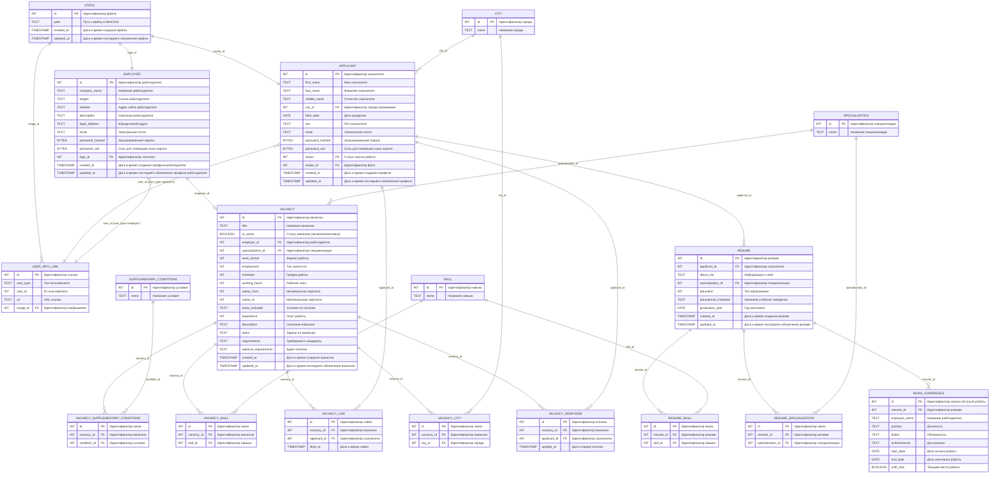

## ER-диаграмма

```mermaid
erDiagram
    STATIC {
        INT id PK "Идентификатор файла"
        TEXT path "Путь к файлу в MinIO/S3"
        TIMESTAMP created_at "Дата и время создания файла"
        TIMESTAMP updated_at "Дата и время последнего обновления файла"
    }

    APPLICANT {
        INT id PK "Идентификатор соискателя"
        TEXT first_name "Имя соискателя"
        TEXT last_name "Фамилия соискателя"
        TEXT middle_name "Отчество соискателя"
        INT city_id FK "Идентификатор города проживания"
        DATE birth_date "Дата рождения"
        TEXT sex "Пол соискателя"
        TEXT email "Электронная почта"
        BYTEA password_hashed "Захэшированный пароль"
        BYTEA password_salt "Соль для генерации хэша пароля"
        INT status FK "Статус поиска работы"
        INT avatar_id FK "Идентификатор фото"
        TIMESTAMP created_at "Дата и время создания профиля"
        TIMESTAMP updated_at "Дата и время последнего обновления профиля"
    }

    CITY {
        INT id PK "Идентификатор города"
        TEXT name "Название города"
    }

    VACANCY_CITY {
        INT id PK "Идентификатор связи"
        INT vacancy_id FK "Идентификатор вакансии"
        INT city_id FK "Идентификатор города"
    }

    EMPLOYER {
        INT id PK "Идентификатор работодателя"
        TEXT company_name "Название работодателя"
        TEXT slogan "Слоган работодателя"
        TEXT website "Адрес сайта работодателя"
        TEXT description "Описание работодателя"
        TEXT legal_address "Юридический адрес"
        TEXT email "Электронная почта"
        BYTEA password_hashed "Захэшированный пароль"
        BYTEA password_salt "Соль для генерации хэша пароля"
        INT logo_id FK "Идентификатор логотипа"
        TIMESTAMP created_at "Дата и время создания профиля работодателя"
        TIMESTAMP updated_at "Дата и время последнего обновления профиля работодателя"
    }

    USER_INFO_LINK {
        INT id PK "Идентификатор ссылки"
        TEXT user_type "Тип пользователя"
        INT user_id "ID пользователя"
        TEXT url "URL ссылки"
        INT image_id FK "Идентификатор изображения"
    }

    VACANCY {
        INT id PK "Идентификатор вакансии"
        TEXT title "Название вакансии"
        BOOLEAN is_active "Статус вакансии (активна/неактивна)"
        INT employer_id FK "Идентификатор работодателя"
        INT specialization_id FK "Идентификатор специализации"
        INT work_format "Формат работы"
        INT employment "Тип занятости"
        INT schedule "График работы"
        INT working_hours "Рабочие часы"
        INT salary_from "Минимальная зарплата"
        INT salary_to "Максимальная зарплата"
        TEXT taxes_included "Условия по налогам"
        INT experience "Опыт работы"
        TEXT description "Описание вакансии"
        TEXT tasks "Задачи по вакансии"
        TEXT requirements "Требования к кандидату"
        TEXT optional_requirements "Будет плюсом"
        TIMESTAMP created_at "Дата и время создания вакансии"
        TIMESTAMP updated_at "Дата и время последнего обновления вакансии"
    }

    SPECIALIZATION {
        INT id PK "Идентификатор специализации"
        TEXT name "Название специализации"
    }


    SUPPLEMENTARY_CONDITIONS {
        INT id PK "Идентификатор условия"
        TEXT name "Название условия"
    }

    VACANCY_SUPPLEMENTARY_CONDITIONS {
        INT id PK "Идентификатор связи"
        INT vacancy_id FK "Идентификатор вакансии"
        INT condition_id FK "Идентификатор условия"
    }

    SKILL {
        INT id PK "Идентификатор навыка"
        TEXT name "Название навыка"
    }

    VACANCY_SKILL {
        INT id PK "Идентификатор связи"
        INT vacancy_id FK "Идентификатор вакансии"
        INT skill_id FK "Идентификатор навыка"
    }

    VACANCY_RESPONSE {
        INT id PK "Идентификатор отклика"
        INT vacancy_id FK "Идентификатор вакансии"
        INT applicant_id FK "Идентификатор соискателя"
        TIMESTAMP applied_at "Дата и время отклика"
    }

    VACANCY_LIKE {
        INT id PK "Идентификатор лайка"
        INT vacancy_id FK "Идентификатор вакансии"
        INT applicant_id FK "Идентификатор соискателя"
        TIMESTAMP liked_at "Дата и время лайка"
    }

    RESUME_SPECIALIZATION {
        INT id PK "Идентификатор связи"
        INT resume_id FK "Идентификатор резюме"
        INT specialization_id FK "Идентификатор специализации"
    }

    RESUME {
        INT id PK "Идентификатор резюме"
        INT applicant_id FK "Идентификатор соискателя"
        TEXT about_me "Информация о себе"
        INT specialization_id FK "Идентификатор специализации"
        INT education "Тип образования"
        TEXT educational_institution "Название учебного заведения"
        DATE graduation_year "Год окончания"
        TIMESTAMP created_at "Дата и время создания резюме"
        TIMESTAMP updated_at "Дата и время последнего обновления резюме"
    }

    WORK_EXPERIENCE {
        INT id PK "Идентификатор записи об опыте работы"
        INT resume_id FK "Идентификатор резюме"
        TEXT employer_name "Название работодателя"
        TEXT position "Должность"
        TEXT duties "Обязанности"
        TEXT achievements "Достижения"
        DATE start_date "Дата начала работы"
        DATE end_date "Дата окончания работы"
        BOOLEAN until_now "Текущее место работы"
    }

    RESUME_SKILL {
        INT id PK "Идентификатор связи"
        INT resume_id FK "Идентификатор резюме"
        INT skill_id FK "Идентификатор навыка"
    }

    STATIC ||--|| APPLICANT : "avatar_id"
    CITY ||--o{ APPLICANT : "city_id"
    STATIC ||--|| EMPLOYER : "logo_id"
    STATIC ||--o{ USER_INFO_LINK : "image_id"
    APPLICANT }o--|| USER_INFO_LINK : "user_id (user_type='applicant')"
    EMPLOYER }o--|| USER_INFO_LINK : "user_id (user_type='employer')"
    EMPLOYER ||--o| VACANCY : "employer_id"
    SPECIALIZATION ||--o{ VACANCY : "specialization_id"
    VACANCY ||--o{ VACANCY_CITY : "vacancy_id"
    CITY ||--o{ VACANCY_CITY : "city_id"
    VACANCY ||--o{ VACANCY_SUPPLEMENTARY_CONDITIONS : "vacancy_id"
    SUPPLEMENTARY_CONDITIONS ||--o{ VACANCY_SUPPLEMENTARY_CONDITIONS : "condition_id"
    VACANCY ||--o{ VACANCY_SKILL : "vacancy_id"
    SKILL ||--o{ VACANCY_SKILL : "skill_id"
    VACANCY ||--o{ VACANCY_RESPONSE : "vacancy_id"
    APPLICANT ||--o{ VACANCY_RESPONSE : "applicant_id"
    VACANCY ||--o{ VACANCY_LIKE : "vacancy_id"
    APPLICANT ||--o{ VACANCY_LIKE : "applicant_id"
    RESUME ||--o{ RESUME_SPECIALIZATION : "resume_id"
    SPECIALIZATION ||--o{ RESUME_SPECIALIZATION : "specialization_id"
    APPLICANT ||--o{ RESUME : "applicant_id"
    RESUME ||--o{ WORK_EXPERIENCE : "resume_id"
    RESUME ||--o{ RESUME_SKILL : "resume_id"
    SKILL ||--o{ RESUME_SKILL : "skill_id"
```