## Таблица `STATIC`

Таблица `STATIC` содержит информацию о статических данных, таких как изображения, которые загружаются на сайт. Это могут быть аватары пользователей, логотипы работодателей, фотографии резюме и другие файлы.

### Функциональные зависимости
- `{id} -> {path, created_at, updated_at}`

### Нормальные формы
- НФ1:
  - в таблице отсутствуют дублирующиеся строки
  - в каждой ячейке хранится атомарное значение
  - в столбце хранятся данные одного типа
  - отсутствуют массивы и списки в любом виде
- НФ2:
  - таблица находится в НФ1
  - таблица имеет ключ
  - все неключевые столбцы зависят от полного ключа
- НФ3:
  - таблица находится в НФ2
  - в таблицах отсутствует транзитивная зависимость
- НФБК:
  - таблица находится в НФ3
  - ключевые атрибуты составного ключа не должны зависеть от неключевых атрибутов (составной ключ отсутствует)

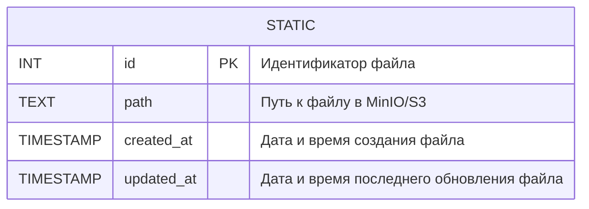
```mermaid
erDiagram
    STATIC {
        INT id PK "Идентификатор файла"
        TEXT path "Путь к файлу в MinIO/S3"
        TIMESTAMP created_at "Дата и время создания файла"
        TIMESTAMP updated_at "Дата и время последнего обновления файла"
    }
```

## Таблица `APPLICANT`

Таблица `APPLICANT` хранит информацию о соискателях (пользователях, которые ищут работу). Включает персональные данные, контактную информацию и статус поиска работы.

### Функциональные зависимости
- `{id} -> {first_name, last_name, middle_name, city, birth_date, sex, email, password, status, avatar_id, created_at, updated_at}`

### Нормальные формы
- НФ1:
  - в таблице отсутствуют дублирующиеся строки
  - в каждой ячейке хранится атомарное значение
  - в столбце хранятся данные одного типа
  - отсутствуют массивы и списки в любом виде
- НФ2:
  - таблица находится в НФ1
  - таблица имеет ключ
  - все неключевые столбцы зависят от полного ключа
- НФ3:
  - таблица находится в НФ2
  - в таблицах отсутствует транзитивная зависимость
- НФБК:
  - таблица находится в НФ3
  - ключевые атрибуты составного ключа не должны зависеть от неключевых атрибутов (составной ключ отсутствует)

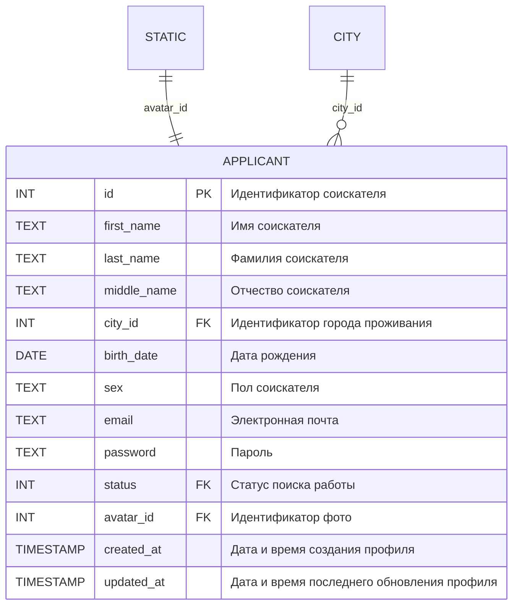
```mermaid
erDiagram
    APPLICANT {
        INT id PK "Идентификатор соискателя"
        TEXT first_name "Имя соискателя"
        TEXT last_name "Фамилия соискателя"
        TEXT middle_name "Отчество соискателя"
        INT city_id FK "Идентификатор города проживания"
        DATE birth_date "Дата рождения"
        TEXT sex "Пол соискателя"
        TEXT email "Электронная почта"
        TEXT password "Пароль"
        INT status FK "Статус поиска работы"
        INT avatar_id FK "Идентификатор фото"
        TIMESTAMP created_at "Дата и время создания профиля"
        TIMESTAMP updated_at "Дата и время последнего обновления профиля"
    }
    STATIC ||--|| APPLICANT : "avatar_id"
    CITY ||--o{ APPLICANT : "city_id"
```

## Таблица `CITY`

Таблица `CITY` будет хранить информацию о городах. Каждая запись будет содержать уникальный идентификатор города и его название.

### Функциональные зависимости
- `{id} -> {name}`

### Нормальные формы
- НФ1:
  - в таблице отсутствуют дублирующиеся строки
  - в каждой ячейке хранится атомарное значение
  - в столбце хранятся данные одного типа
  - отсутствуют массивы и списки в любом виде
- НФ2:
  - таблица находится в НФ1
  - таблица имеет ключ
  - все неключевые столбцы зависят от полного ключа
- НФ3:
  - таблица находится в НФ2
  - в таблицах отсутствует транзитивная зависимость
- НФБК:
  - таблица находится в НФ3
  - ключевые атрибуты составного ключа не должны зависеть от неключевых атрибутов (составной ключ отсутствует)

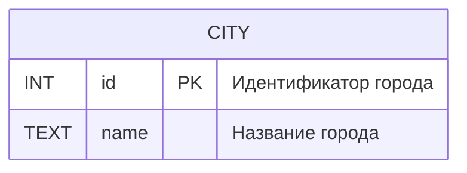
```mermaid
erDiagram
    CITY {
        INT id PK "Идентификатор города"
        TEXT name "Название города"
    }
```

## Таблица `VACANCY_CITY`

Таблицу `VACANCY_CITY` нужна для поддержки связи "многие-ко-многим" между вакансиями и городами.

### Функциональные зависимости
- `{id} -> {vacancy_id, city_id}`

### Нормальные формы
- НФ1:
  - в таблице отсутствуют дублирующиеся строки
  - в каждой ячейке хранится атомарное значение
  - в столбце хранятся данные одного типа
  - отсутствуют массивы и списки в любом виде
- НФ2:
  - таблица находится в НФ1
  - таблица имеет ключ
  - все неключевые столбцы зависят от полного ключа
- НФ3:
  - таблица находится в НФ2
  - в таблицах отсутствует транзитивная зависимость
- НФБК:
  - таблица находится в НФ3
  - ключевые атрибуты составного ключа не должны зависеть от неключевых атрибутов (составной ключ отсутствует)

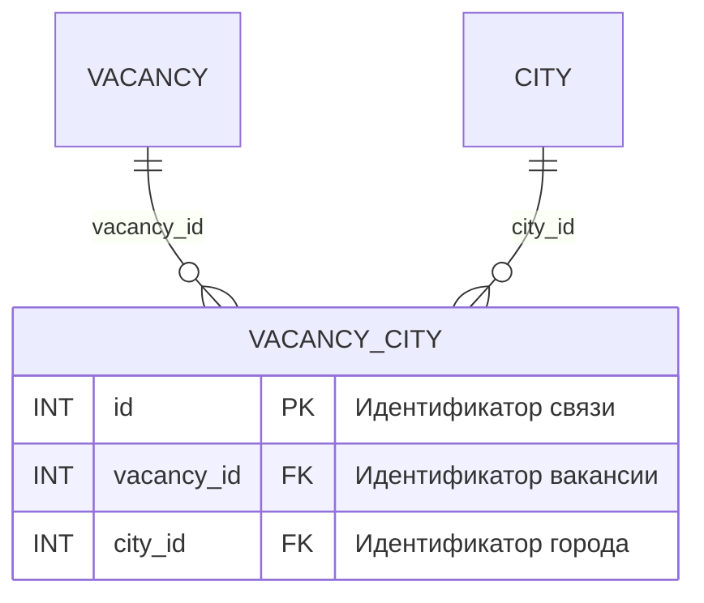
```mermaid
erDiagram
    VACANCY_CITY {
        INT id PK "Идентификатор связи"
        INT vacancy_id FK "Идентификатор вакансии"
        INT city_id FK "Идентификатор города"
    }
    VACANCY ||--o{ VACANCY_CITY : "vacancy_id"
    CITY ||--o{ VACANCY_CITY : "city_id"
```

## Таблица `EMPLOYER`

Таблица `EMPLOYER` хранит информацию о работодателях. Включает название работодателя, контактную информацию, юридический адрес и логотип.

### Функциональные зависимости
- `{id} -> {name, slogan, website, description, legal_address, email, logo_id, created_at, updated_at}`

### Нормальные формы
- НФ1:
  - в таблице отсутствуют дублирующиеся строки
  - в каждой ячейке хранится атомарное значение
  - в столбце хранятся данные одного типа
  - отсутствуют массивы и списки в любом виде
- НФ2:
  - таблица находится в НФ1
  - таблица имеет ключ
  - все неключевые столбцы зависят от полного ключа
- НФ3:
  - таблица находится в НФ2
  - в таблицах отсутствует транзитивная зависимость
- НФБК:
  - таблица находится в НФ3
  - ключевые атрибуты составного ключа не должны зависеть от неключевых атрибутов (составной ключ отсутствует)

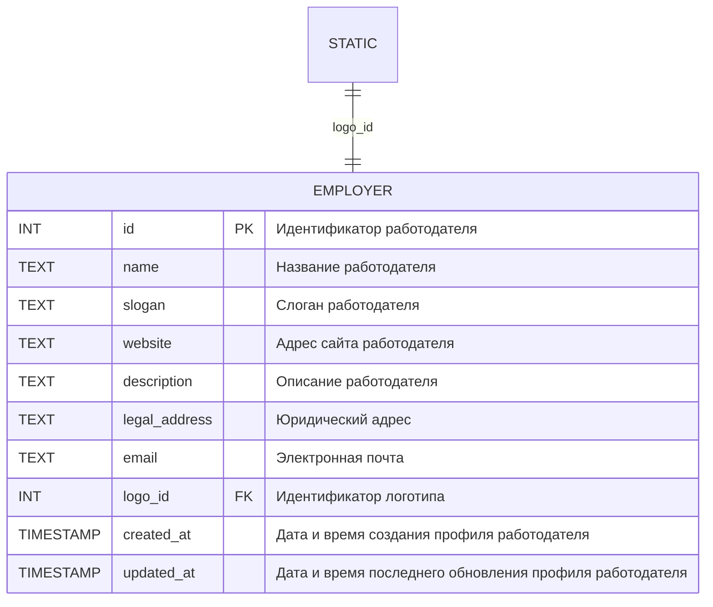
```mermaid
erDiagram
    EMPLOYER {
        INT id PK "Идентификатор работодателя"
        TEXT name "Название работодателя"
        TEXT slogan "Слоган работодателя"
        TEXT website "Адрес сайта работодателя"
        TEXT description "Описание работодателя"
        TEXT legal_address "Юридический адрес"
        TEXT email "Электронная почта"
        INT logo_id FK "Идентификатор логотипа"
        TIMESTAMP created_at "Дата и время создания профиля работодателя"
        TIMESTAMP updated_at "Дата и время последнего обновления профиля работодателя"
    }
    STATIC ||--|| EMPLOYER : "logo_id"
```

## Таблица `EMPLOYER_INFO_LINK`

Таблица `EMPLOYER_INFO_LINK` хранит информацию об информационных ресурсах работодателя (например, ссылки на социальные сети или другие платформы). Каждый ресурс может иметь логотип.

### Функциональные зависимости
- `{id} -> {employer_id, image_id, url}`

### Нормальные формы
- НФ1:
  - в таблице отсутствуют дублирующиеся строки
  - в каждой ячейке хранится атомарное значение
  - в столбце хранятся данные одного типа
  - отсутствуют массивы и списки в любом виде
- НФ2:
  - таблица находится в НФ1
  - таблица имеет ключ
  - все неключевые столбцы зависят от полного ключа
- НФ3:
  - таблица находится в НФ2
  - в таблицах отсутствует транзитивная зависимость
- НФБК:
  - таблица находится в НФ3
  - ключевые атрибуты составного ключа не должны зависеть от неключевых атрибутов (составной ключ отсутствует)

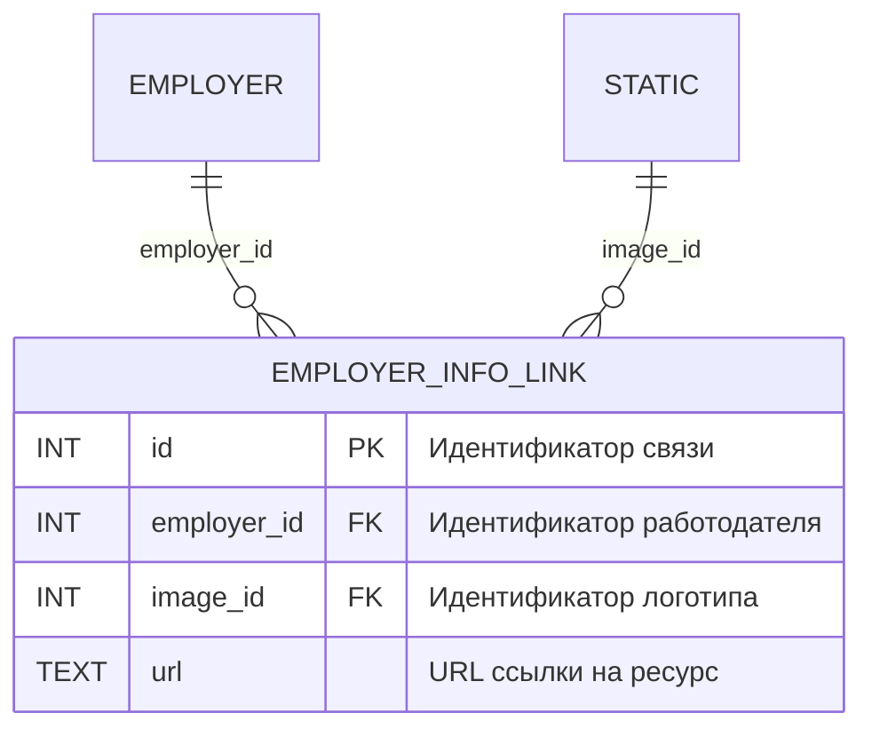
```mermaid
erDiagram
    EMPLOYER_INFO_LINK {
        INT id PK "Идентификатор связи"
        INT employer_id FK "Идентификатор работодателя"
        INT image_id FK "Идентификатор логотипа"
        TEXT url "URL ссылки на ресурс"
    }
    EMPLOYER ||--o{ EMPLOYER_INFO_LINK : "employer_id"
    STATIC ||--o{ EMPLOYER_INFO_LINK : "image_id"
```

## Таблица `VACANCY`

Таблица `VACANCY` хранит информацию о вакансиях, размещенных работодателями. Включает название вакансии, описание, требования, зарплату и другие детали.

### Функциональные зависимости
- `{id} -> {title, is_active, employer_id, specialization_id, work_format, employment_type, schedule, working_hours, salary_from, salary_to, taxes, experience, description, tasks, requirements, optional_requirements, created_at, updated_at}`

### Нормальные формы
- НФ1:
  - в таблице отсутствуют дублирующиеся строки
  - в каждой ячейке хранится атомарное значение
  - в столбце хранятся данные одного типа
  - отсутствуют массивы и списки в любом виде
- НФ2:
  - таблица находится в НФ1
  - таблица имеет ключ
  - все неключевые столбцы зависят от полного ключа
- НФ3:
  - таблица находится в НФ2
  - в таблицах отсутствует транзитивная зависимость
- НФБК:
  - таблица находится в НФ3
  - ключевые атрибуты составного ключа не должны зависеть от неключевых атрибутов (составной ключ отсутствует)

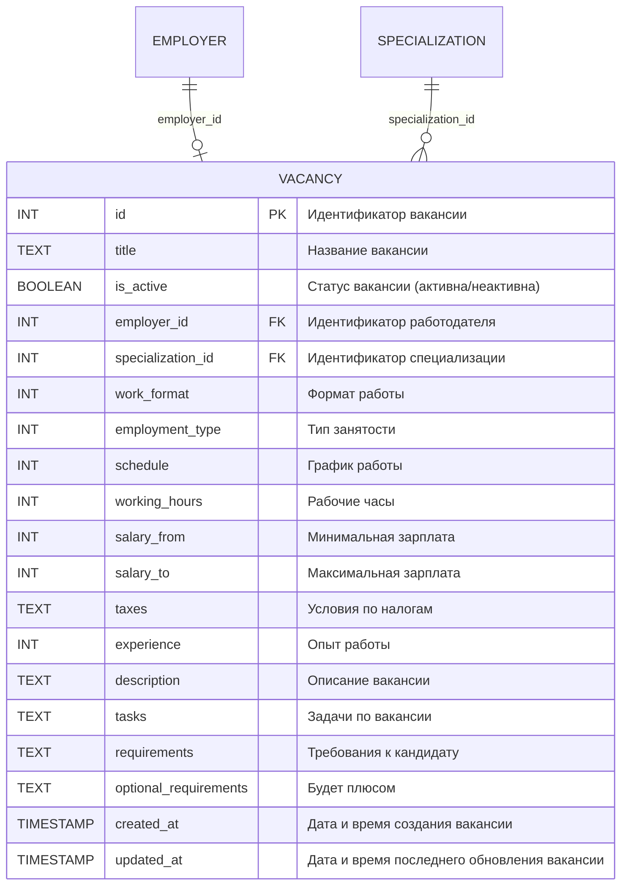
```mermaid
erDiagram
    VACANCY {
        INT id PK "Идентификатор вакансии"
        TEXT title "Название вакансии"
        BOOLEAN is_active "Статус вакансии (активна/неактивна)"
        INT employer_id FK "Идентификатор работодателя"
        INT specialization_id FK "Идентификатор специализации"
        INT work_format "Формат работы"
        INT employment_type "Тип занятости"
        INT schedule "График работы"
        INT working_hours "Рабочие часы"
        INT salary_from "Минимальная зарплата"
        INT salary_to "Максимальная зарплата"
        TEXT taxes "Условия по налогам"
        INT experience "Опыт работы"
        TEXT description "Описание вакансии"
        TEXT tasks "Задачи по вакансии"
        TEXT requirements "Требования к кандидату"
        TEXT optional_requirements "Будет плюсом"
        TIMESTAMP created_at "Дата и время создания вакансии"
        TIMESTAMP updated_at "Дата и время последнего обновления вакансии"
    }
    EMPLOYER ||--o| VACANCY : "employer_id"
    SPECIALIZATION ||--o{ VACANCY : "specialization_id"
```

## Таблица `SPECIALIZATION`

Таблица `SPECIALIZATION` хранит информацию о специализациях (например, "Программист", "Аналитик").

### Функциональные зависимости
- `{id} -> {name}`

### Нормальные формы
- НФ1:
  - в таблице отсутствуют дублирующиеся строки
  - в каждой ячейке хранится атомарное значение
  - в столбце хранятся данные одного типа
  - отсутствуют массивы и списки в любом виде
- НФ2:
  - таблица находится в НФ1
  - таблица имеет ключ
  - все неключевые столбцы зависят от полного ключа
- НФ3:
  - таблица находится в НФ2
  - в таблицах отсутствует транзитивная зависимость
- НФБК:
  - таблица находится в НФ3
  - ключевые атрибуты составного ключа не должны зависеть от неключевых атрибутов (составной ключ отсутствует)

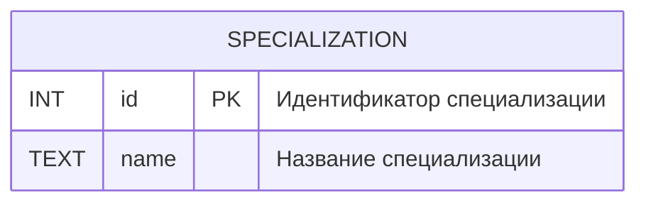
```mermaid
erDiagram
    SPECIALIZATION {
        INT id PK "Идентификатор специализации"
        TEXT name "Название специализации"
    }
```

## Таблица `SUPPLEMENTARY_CONDITIONS`

Таблица `SUPPLEMENTARY_CONDITIONS` хранит информацию о дополнительных условиях по вакансии (например, "Возможно временное оформление" или "С 14 лет").

### Функциональные зависимости
- `{id} -> {name}`

### Нормальные формы
- НФ1:
  - в таблице отсутствуют дублирующиеся строки
  - в каждой ячейке хранится атомарное значение
  - в столбце хранятся данные одного типа
  - отсутствуют массивы и списки в любом виде
- НФ2:
  - таблица находится в НФ1
  - таблица имеет ключ
  - все неключевые столбцы зависят от полного ключа
- НФ3:
  - таблица находится в НФ2
  - в таблицах отсутствует транзитивная зависимость
- НФБК:
  - таблица находится в НФ3
  - ключевые атрибуты составного ключа не должны зависеть от неключевых атрибутов (составной ключ отсутствует)

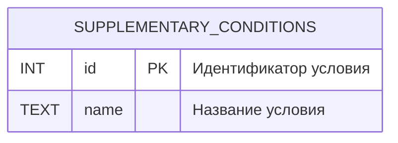
```mermaid
erDiagram
    SUPPLEMENTARY_CONDITIONS {
        INT id PK "Идентификатор условия"
        TEXT name "Название условия"
    }
```

## Таблица `VACANCY_SUPPLEMENTARY_CONDITIONS`

Таблица `VACANCY_SUPPLEMENTARY_CONDITIONS` связывает вакансии с дополнительными условиями.

### Функциональные зависимости
- `{id} -> {vacancy_id, condition_id}`

### Нормальные формы
- НФ1:
  - в таблице отсутствуют дублирующиеся строки
  - в каждой ячейке хранится атомарное значение
  - в столбце хранятся данные одного типа
  - отсутствуют массивы и списки в любом виде
- НФ2:
  - таблица находится в НФ1
  - таблица имеет ключ
  - все неключевые столбцы зависят от полного ключа
- НФ3:
  - таблица находится в НФ2
  - в таблицах отсутствует транзитивная зависимость
- НФБК:
  - таблица находится в НФ3
  - ключевые атрибуты составного ключа не должны зависеть от неключевых атрибутов (составной ключ отсутствует)

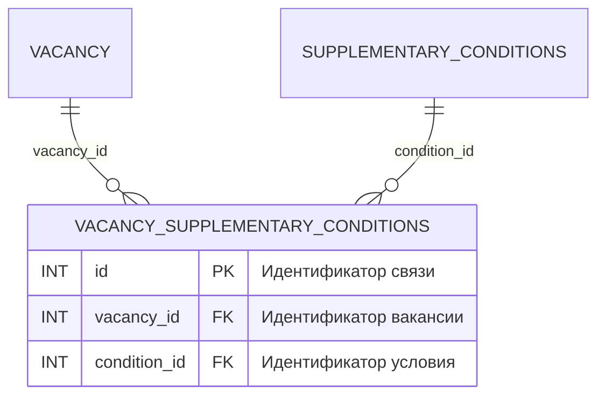
```mermaid
erDiagram
    VACANCY_SUPPLEMENTARY_CONDITIONS {
        INT id PK "Идентификатор связи"
        INT vacancy_id FK "Идентификатор вакансии"
        INT condition_id FK "Идентификатор условия"
    }
    VACANCY ||--o{ VACANCY_SUPPLEMENTARY_CONDITIONS : "vacancy_id"
    SUPPLEMENTARY_CONDITIONS ||--o{ VACANCY_SUPPLEMENTARY_CONDITIONS : "condition_id"
```

## Таблица `SKILL`

Таблица `SKILL` хранит информацию о навыках (например, "Python", "SQL").

### Функциональные зависимости
- `{id} -> {name}`

### Нормальные формы
- НФ1:
  - в таблице отсутствуют дублирующиеся строки
  - в каждой ячейке хранится атомарное значение
  - в столбце хранятся данные одного типа
  - отсутствуют массивы и списки в любом виде
- НФ2:
  - таблица находится в НФ1
  - таблица имеет ключ
  - все неключевые столбцы зависят от полного ключа
- НФ3:
  - таблица находится в НФ2
  - в таблицах отсутствует транзитивная зависимость
- НФБК:
  - таблица находится в НФ3
  - ключевые атрибуты составного ключа не должны зависеть от неключевых атрибутов (составной ключ отсутствует)

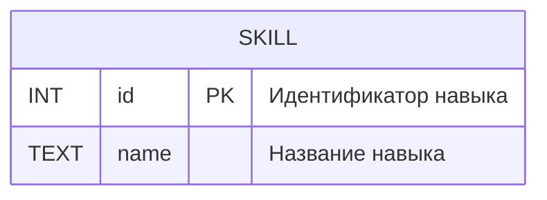
```mermaid
erDiagram
    SKILL {
        INT id PK "Идентификатор навыка"
        TEXT name "Название навыка"
    }
```

## Таблица `VACANCY_SKILL`

Таблица `VACANCY_SKILL` связывает вакансии с навыками.

### Функциональные зависимости
- `{id} -> {vacancy_id, skill_id}`

### Нормальные формы
- НФ1:
  - в таблице отсутствуют дублирующиеся строки
  - в каждой ячейке хранится атомарное значение
  - в столбце хранятся данные одного типа
  - отсутствуют массивы и списки в любом виде
- НФ2:
  - таблица находится в НФ1
  - таблица имеет ключ
  - все неключевые столбцы зависят от полного ключа
- НФ3:
  - таблица находится в НФ2
  - в таблицах отсутствует транзитивная зависимость
- НФБК:
  - таблица находится в НФ3
  - ключевые атрибуты составного ключа не должны зависеть от неключевых атрибутов (составной ключ отсутствует)

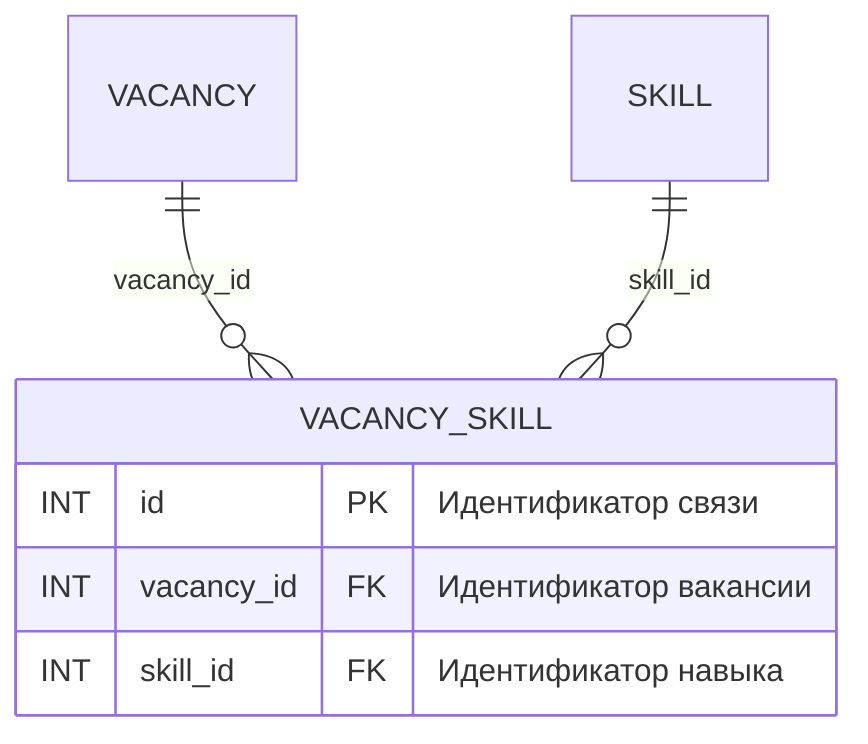
```mermaid
erDiagram
    VACANCY_SKILL {
        INT id PK "Идентификатор связи"
        INT vacancy_id FK "Идентификатор вакансии"
        INT skill_id FK "Идентификатор навыка"
    }
    VACANCY ||--o{ VACANCY_SKILL : "vacancy_id"
    SKILL ||--o{ VACANCY_SKILL : "skill_id"
```

## Таблица `VACANCY_RESPONSE`

Таблица `VACANCY_RESPONSE` хранит информацию об откликах соискателей на вакансии.

### Функциональные зависимости
- `{id} -> {vacancy_id, applicant_id, applied_at}`

### Нормальные формы
- НФ1:
  - в таблице отсутствуют дублирующиеся строки
  - в каждой ячейке хранится атомарное значение
  - в столбце хранятся данные одного типа
  - отсутствуют массивы и списки в любом виде
- НФ2:
  - таблица находится в НФ1
  - таблица имеет ключ
  - все неключевые столбцы зависят от полного ключа
- НФ3:
  - таблица находится в НФ2
  - в таблицах отсутствует транзитивная зависимость
- НФБК:
  - таблица находится в НФ3
  - ключевые атрибуты составного ключа не должны зависеть от неключевых атрибутов (составной ключ отсутствует)

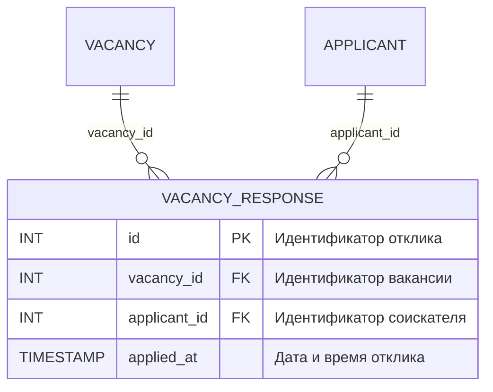
```mermaid
erDiagram
    VACANCY_RESPONSE {
        INT id PK "Идентификатор отклика"
        INT vacancy_id FK "Идентификатор вакансии"
        INT applicant_id FK "Идентификатор соискателя"
        TIMESTAMP applied_at "Дата и время отклика"
    }
    VACANCY ||--o{ VACANCY_RESPONSE : "vacancy_id"
    APPLICANT ||--o{ VACANCY_RESPONSE : "applicant_id"
```

## Таблица `VACANCY_LIKE`

Таблица `VACANCY_LIKE` хранит информацию о понравившихся ("лайкнутых") соискателю вакансиях.

### Функциональные зависимости
- `{id} -> {vacancy_id, applicant_id, liked_at}`

### Нормальные формы
- НФ1:
  - в таблице отсутствуют дублирующиеся строки
  - в каждой ячейке хранится атомарное значение
  - в столбце хранятся данные одного типа
  - отсутствуют массивы и списки в любом виде
- НФ2:
  - таблица находится в НФ1
  - таблица имеет ключ
  - все неключевые столбцы зависят от полного ключа
- НФ3:
  - таблица находится в НФ2
  - в таблицах отсутствует транзитивная зависимость
- НФБК:
  - таблица находится в НФ3
  - ключевые атрибуты составного ключа не должны зависеть от неключевых атрибутов (составной ключ отсутствует)

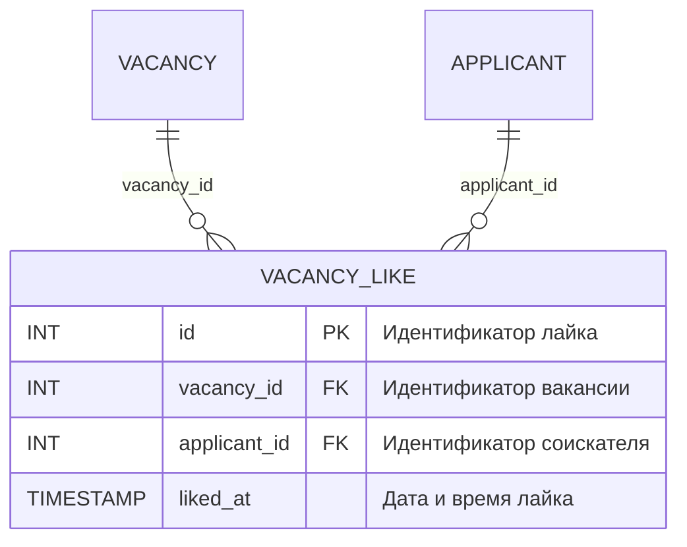
```mermaid
erDiagram
    VACANCY_LIKE {
        INT id PK "Идентификатор лайка"
        INT vacancy_id FK "Идентификатор вакансии"
        INT applicant_id FK "Идентификатор соискателя"
        TIMESTAMP liked_at "Дата и время лайка"
    }
    VACANCY ||--o{ VACANCY_LIKE : "vacancy_id"
    APPLICANT ||--o{ VACANCY_LIKE : "applicant_id"
```

## Таблица `RESUME_SPECIALIZATION`

Таблица `RESUME_SPECIALIZATION` реализует связь "многие-ко-многим" между резюме и специализациями.

### Функциональные зависимости
- `{id} -> {resume_id, specialization_id}`

### Нормальные формы
- НФ1:
  - в таблице отсутствуют дублирующиеся строки
  - в каждой ячейке хранится атомарное значение
  - в столбце хранятся данные одного типа
  - отсутствуют массивы и списки в любом виде
- НФ2:
  - таблица находится в НФ1
  - таблица имеет ключ
  - все неключевые столбцы зависят от полного ключа
- НФ3:
  - таблица находится в НФ2
  - в таблицах отсутствует транзитивная зависимость
- НФБК:
  - таблица находится в НФ3
  - ключевые атрибуты составного ключа не должны зависеть от неключевых атрибутов (составной ключ отсутствует)

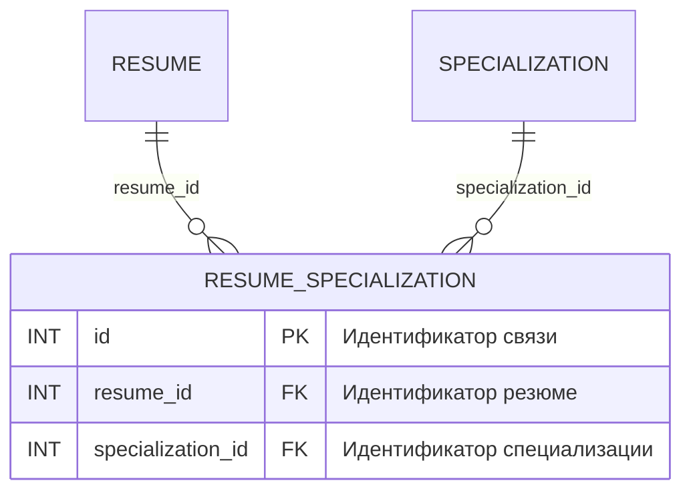
```mermaid
erDiagram
    RESUME_SPECIALIZATION {
        INT id PK "Идентификатор связи"
        INT resume_id FK "Идентификатор резюме"
        INT specialization_id FK "Идентификатор специализации"
    }
    RESUME ||--o{ RESUME_SPECIALIZATION : "resume_id"
    SPECIALIZATION ||--o{ RESUME_SPECIALIZATION : "specialization_id"
```

## Таблица `RESUME`

Таблица `RESUME` хранит информацию о резюме соискателей.

### Функциональные зависимости
- `{id} -> {applicant_id, about_me, specialization_id, education_type, educational_institution, graduation_year, created_at, updated_at}`

### Нормальные формы
- НФ1:
  - в таблице отсутствуют дублирующиеся строки
  - в каждой ячейке хранится атомарное значение
  - в столбце хранятся данные одного типа
  - отсутствуют массивы и списки в любом виде
- НФ2:
  - таблица находится в НФ1
  - таблица имеет ключ
  - все неключевые столбцы зависят от полного ключа
- НФ3:
  - таблица находится в НФ2
  - в таблицах отсутствует транзитивная зависимость
- НФБК:
  - таблица находится в НФ3
  - ключевые атрибуты составного ключа не должны зависеть от неключевых атрибутов (составной ключ отсутствует)

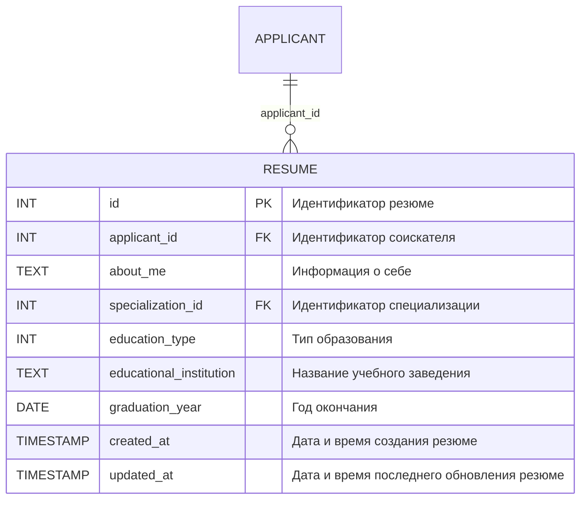
```mermaid
erDiagram
    RESUME {
        INT id PK "Идентификатор резюме"
        INT applicant_id FK "Идентификатор соискателя"
        TEXT about_me "Информация о себе"
        INT specialization_id FK "Идентификатор специализации"
        INT education_type "Тип образования"
        TEXT educational_institution "Название учебного заведения"
        DATE graduation_year "Год окончания"
        TIMESTAMP created_at "Дата и время создания резюме"
        TIMESTAMP updated_at "Дата и время последнего обновления резюме"
    }
    APPLICANT ||--o{ RESUME : "applicant_id"
```

## Таблица `WORK_EXPERIENCE`

Таблица `WORK_EXPERIENCE` хранит информацию об опыте работы соискателей.

### Функциональные зависимости
- `{id} -> {resume_id, employer_name, position, duties, achievements, start_date, end_date, until_now}`

### Нормальные формы
- НФ1:
  - в таблице отсутствуют дублирующиеся строки
  - в каждой ячейке хранится атомарное значение
  - в столбце хранятся данные одного типа
  - отсутствуют массивы и списки в любом виде
- НФ2:
  - таблица находится в НФ1
  - таблица имеет ключ
  - все неключевые столбцы зависят от полного ключа
- НФ3:
  - таблица находится в НФ2
  - в таблицах отсутствует транзитивная зависимость
- НФБК:
  - таблица находится в НФ3
  - ключевые атрибуты составного ключа не должны зависеть от неключевых атрибутов (составной ключ отсутствует)

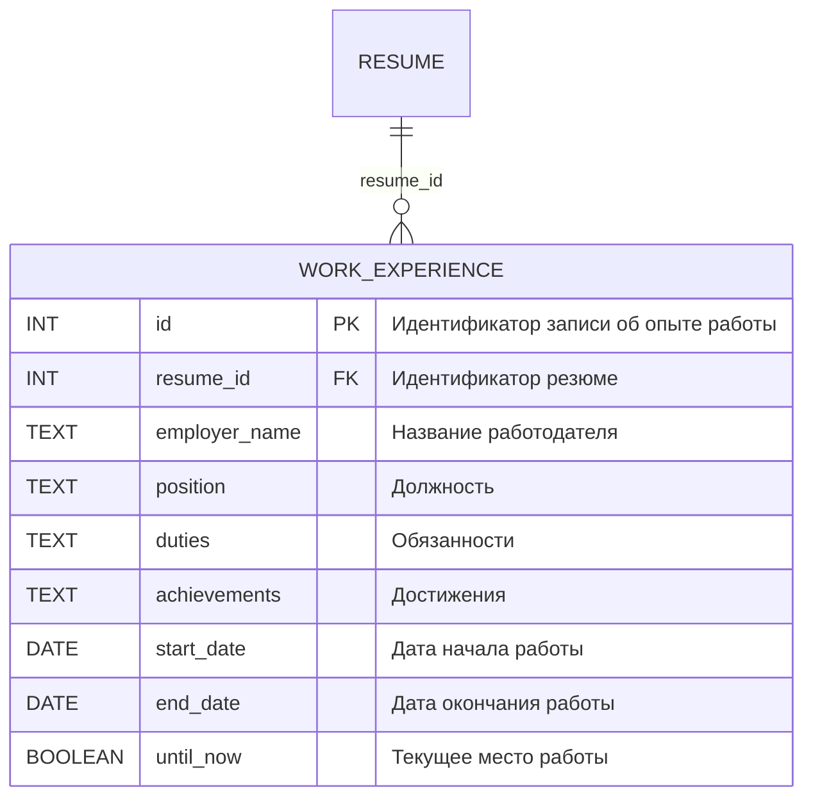
```mermaid
erDiagram
    WORK_EXPERIENCE {
        INT id PK "Идентификатор записи об опыте работы"
        INT resume_id FK "Идентификатор резюме"
        TEXT employer_name "Название работодателя"
        TEXT position "Должность"
        TEXT duties "Обязанности"
        TEXT achievements "Достижения"
        DATE start_date "Дата начала работы"
        DATE end_date "Дата окончания работы"
        BOOLEAN until_now "Текущее место работы"
    }
    RESUME ||--o{ WORK_EXPERIENCE : "resume_id"
```

## Таблица `RESUME_SKILL`

Таблица `RESUME_SKILL` связывает резюме с навыками.

### Функциональные зависимости
- `{id} -> {resume_id, skill_id}`

### Нормальные формы
- НФ1:
  - в таблице отсутствуют дублирующиеся строки
  - в каждой ячейке хранится атомарное значение
  - в столбце хранятся данные одного типа
  - отсутствуют массивы и списки в любом виде
- НФ2:
  - таблица находится в НФ1
  - таблица имеет ключ
  - все неключевые столбцы зависят от полного ключа
- НФ3:
  - таблица находится в НФ2
  - в таблицах отсутствует транзитивная зависимость
- НФБК:
  - таблица находится в НФ3
  - ключевые атрибуты составного ключа не должны зависеть от неключевых атрибутов (составной ключ отсутствует)

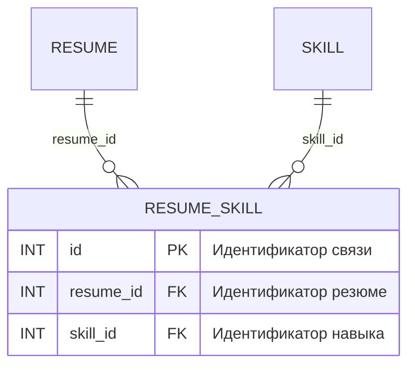
```mermaid
erDiagram
    RESUME_SKILL {
        INT id PK "Идентификатор связи"
        INT resume_id FK "Идентификатор резюме"
        INT skill_id FK "Идентификатор навыка"
    }
    RESUME ||--o{ RESUME_SKILL : "resume_id"
    SKILL ||--o{ RESUME_SKILL : "skill_id"
```